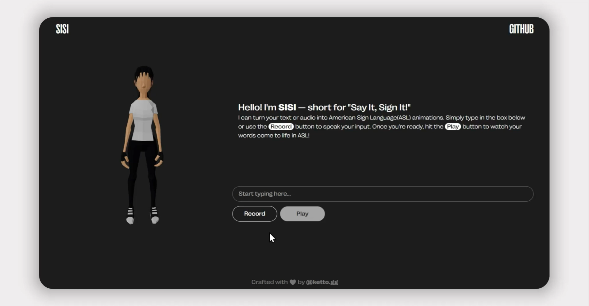

  <h2 align="center">SISI — Say It, Sign It!</h2>
  

 
## What's SISI?
SISI is simply a web-based platform designed to bridge communication gaps by converting text and speech into American Sign Language(ASL) animations. Whether for educational purposes, accessibility improvements, or general communication, SISI provides a user-friendly tool to make interactions more inclusive for the Deaf and hard-of-hearing community. It supports real-time text-to-ASL and speech-to-ASL conversions, ensuring that communication is not just spoken or written but seen.

**_Try it out now at <a href="https://sisi.ketto.space">sisi.ketto.space</a> :)_**

## Demo
